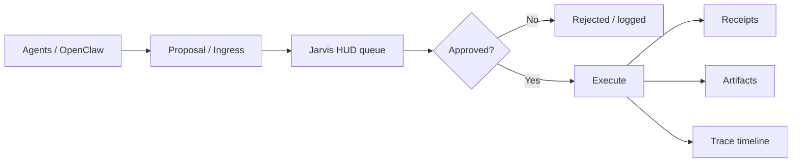
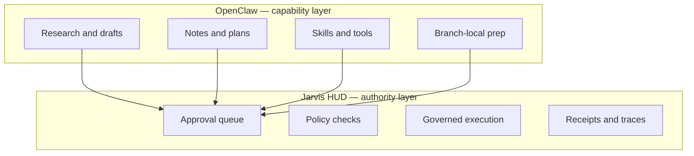
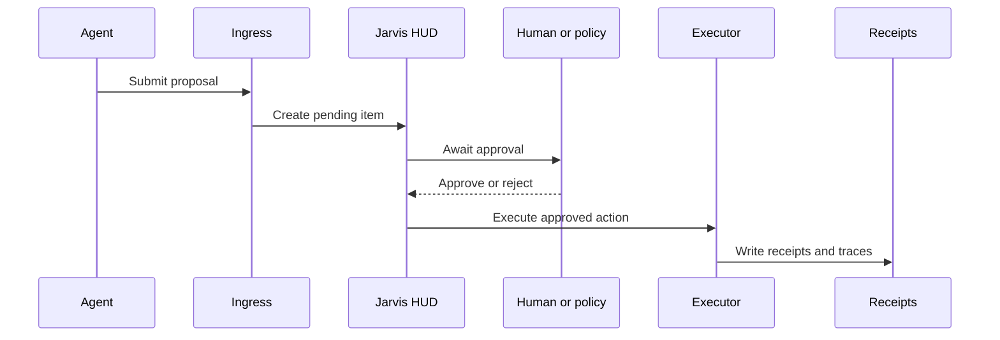

# Jarvis HUD

Jarvis HUD is a control plane that enforces approval before action and produces verifiable execution traces for AI systems.

```bash
pnpm dev
# open http://127.0.0.1:3000
```

**In the browser:** `/docs` is the documentation home—**audience-first** (newcomers, investors, trust story, operators) plus a **curated** file index; use **`/docs?library=all`** for every markdown file. Rendered prose with optional **Slides** mode (split on `##`). New to the product: **`/docs/getting-started/welcome`**. **`/docs/strategy/gener8tor-pitch`** (and **`/pitch`**) matches the cinematic deck from `/demo` (`?view=markdown` for markdown). Short redirects: `/library` → `/docs`, plus `/pitch`, `/playbook`, `/thesis`.

Submit a proposal → approve → see receipt + trace (with rollback). (Use `pnpm install` and optional `.env.local` first — see [Quick Start](#quick-start-developers).) **90s proof demo script:** [docs/video/90s-proof-demo.md](docs/video/90s-proof-demo.md).

**Control plane for governed AI execution.**

Jarvis HUD sits between **AI agents** (e.g. [OpenClaw](https://github.com/openclaw/openclaw)) and **real-world actions**. Agents **propose**. Humans (or explicit policy) **approve**. The system **executes** only after that gate. **Every step leaves receipts and traces.**

> **Status:** Active development — **demo-ready** locally with **OpenClaw-signed ingress** ([Investor / demo path](#investor--demo-path)).


## Why this exists

Modern agents are powerful, but **power without authority boundaries is reckless**. Jarvis HUD makes the lifecycle explicit: **propose → approve → execute → receipt → trace**, so automation stays **observable** and accountable.

Pair a **capability layer** (OpenClaw: research, drafts, skills, tools) with an **authority layer** (Jarvis: queue, policy, execution, audit).

## Core thesis

- **Approval is not execution** — two different steps.
- **Agents propose; they do not commit** high-stakes effects on their own.
- **The model is not a trusted principal** — humans and policy remain in charge.
- **Every action produces proof** — receipts, artifacts, and replayable **traces**.
- **Autonomy in thinking. Authority in action.**

Full narrative: [docs/strategy/jarvis-hud-video-thesis.md](docs/strategy/jarvis-hud-video-thesis.md) · [ADR: Thesis Lock](docs/decisions/0001-thesis-lock.md). Positioning and competition: [docs/strategy/competitive-landscape-2026.md](docs/strategy/competitive-landscape-2026.md) · [Pitch narrative outline](docs/strategy/pitch-narrative-outline.md) · [Gener8tor pitch (6 slides + demo)](docs/strategy/gener8tor-pitch.md) · [Room playbook — restraint](docs/strategy/room-playbook-v1.md).

## Architecture



### OpenClaw vs Jarvis HUD



### Proposal lifecycle



### What crosses the boundary

| Typically **gated in Jarvis** (examples) | Typically **local to OpenClaw** (examples) |
|------------------------------------------|--------------------------------------------|
| Outbound sends, posting, publishing | Drafts and ideation |
| Payments and purchases | Research and summaries |
| Deploys and risky infra changes | Internal notes |
| Irreversible commitments | Tool prep on a branch |

Exact **kinds** and **policy** depend on your configuration — see [execution scope](docs/execution-scope.md) and [decisions](docs/decisions/).

## Who it’s for

**Who:** Developers and operators who run **local agents with real permissions** (files, tools, execution) and need a **human gate** before real-world effects.

**What:** A **Next.js** control plane with HMAC-signed **OpenClaw** ingress, policy-gated execution, and durable receipts under **`JARVIS_ROOT`** (default `~/jarvis`).

---

## Visual

Control plane at a glance (click through for architecture detail):

[](docs/architecture/control-plane.md)

*Optional:* Record a short loop (proposal → approve → receipt) for the README — see [docs/video/jarvis-demo-recording.md](docs/video/jarvis-demo-recording.md).

---

## Local development

**Default (documented everywhere):** two terminals from this repo — **`pnpm dev`** (Jarvis, **http://127.0.0.1:3000**) then **`OPENCLAW_ROOT=~/Documents/openclaw-runtime pnpm openclaw:dev`**, then **`pnpm local:stack:doctor`**. Optional: **`pnpm dev:stack`** prints exact lines and checks `.env.local`.

Full walkthrough: **[docs/setup/local-stack-startup.md](docs/setup/local-stack-startup.md)** · drift / ports: [docs/setup/local-dev-truth-map.md](docs/setup/local-dev-truth-map.md) · OpenClaw checks: [docs/local-verification-openclaw-jarvis.md](docs/local-verification-openclaw-jarvis.md).

**`.env.local`:** use **`http://127.0.0.1:3000`** for **`JARVIS_BASE_URL`** and **`JARVIS_HUD_BASE_URL`** (same host as the browser). Same ingress **secret** on Jarvis and OpenClaw or signed ingress fails (**401**): [docs/openclaw-integration-verification.md](docs/openclaw-integration-verification.md).

**Optional — scripted demo on port 3001:** [DEMO.md](DEMO.md) (`pnpm demo:boot`, `pnpm demo:verify`, `pnpm demo:smoke`). Only when you want that flow; normal day-to-day is **3000** + **`pnpm dev`** above.

### Quick check (when things feel off)

```bash
curl -sS http://127.0.0.1:3000/api/config | head -c 200 || true
```

If you intentionally run Jarvis on another port, curl **that** origin instead — runtime wins over stale env.

---

## Investor / demo path

**Runtime:** Same as **Local development** — **`pnpm dev`** + **`OPENCLAW_ROOT=~/Documents/openclaw-runtime pnpm openclaw:dev`**, then drive proposals from OpenClaw (Alfred) or scripts.

**Optional scripted rehearsal (port 3001):** **[DEMO.md](DEMO.md)** — `pnpm demo:boot`, `pnpm demo:verify`, `pnpm demo:smoke`, and the failure table. Use when you want a fixed demo port and pre-wired `demo-env.sh`.

**In-room proof:** OpenClaw → Jarvis proposal → human **approve** → **execute** → **receipt** / **trace** — [docs/openclaw-integration-verification.md](docs/openclaw-integration-verification.md).

---

## Quick Start (developers)

```bash
pnpm install
cp env.example .env.local   # optional; see docs/setup/env.md
pnpm dev
```

Open **http://127.0.0.1:3000**. Production-style: `pnpm build && pnpm start`. Scripted demo on **3001**: [DEMO.md](DEMO.md) and [Investor / demo path](#investor--demo-path).

**Jarvis + OpenClaw:** [docs/setup/local-stack-startup.md](docs/setup/local-stack-startup.md) — **`pnpm dev`**, **`OPENCLAW_ROOT=~/Documents/openclaw-runtime pnpm openclaw:dev`**, **`pnpm local:stack:doctor`**, **`pnpm machine-wired`**, **`pnpm auth-posture`**. VS Code: Task **Local stack: both (parallel)**.

---

## Core lifecycle

```
Agent → Proposal → Approval → Execution → Receipt → Trace
```

- **Agents propose** (UI, API, or signed **OpenClaw** ingress).
- **Humans approve** (or reject) in the HUD.
- **Execution** runs only after approval — **separate** from the approval click.
- **Proof:** receipt log + artifacts + trace reconstruction.

---

## HTTP surface

Jarvis sits between AI agents and system execution:

- **Agent layer** — systems **propose** actions (e.g. OpenClaw via HMAC-signed `POST /api/ingress/openclaw`).
- **Control plane** — verification, **human** approval, policy, **orchestrated execution**.
- **Audit layer** — receipts under `JARVIS_ROOT` (default `~/jarvis`), policy logs, activity timeline.

**Key routes:**

| Stage     | Route                            | Purpose                  |
|-----------|----------------------------------|--------------------------|
| Ingress   | `POST /api/ingress/openclaw`     | Signed proposals         |
| Approval  | `GET/POST /api/approvals`        | List / approve / deny    |
| Execution | `POST /api/execute/[approvalId]` | Policy gate → adapters |
| Trace     | `GET /api/traces/[traceId]`      | Reconstruct session      |
| Trace     | `GET /api/traces/recent`        | Recent trace ids (disk)  |
| Connectors | `GET /api/connectors/openclaw/health` | OpenClaw trust signal (disk + env) |

→ [Control plane architecture](docs/architecture/control-plane.md)

---

## Features

- **Human-in-the-loop** — Operators **approve** or deny before execution proceeds.
- **Execution separated from approval** — Approve does not run adapters by itself; execute is explicit.
- **Policy-gated execution** — Allow/deny before adapters run.
- **Receipts and proof** — Action log + artifacts per execution; traceable **`traceId`**.
- **OpenClaw ingress** — HMAC-signed proposals when enabled (`docs/setup/env.md`).
- **Bounded adapters** — e.g. `system.note`, `code.diff`, `code.apply`, `youtube.package`, recovery classes.
- **Trace timeline** — Reconstruct proposal → outcome for audit and demo.

### Operator safeguards (local dev)

- **Integration readiness (mismatch-only)** — When server checks fail (ingress off, bad/missing secret, OpenClaw not allowlisted, or no recent OpenClaw signal after prior activity), `GET /api/config` includes `integrationIssues` and the HUD shows a **red** banner with facts and doc links. No “all green” panel — silence means nothing to fix here.
- **OpenClaw Control link** — When `OPENCLAW_CONTROL_UI_URL` is set, the HUD can link to your OpenClaw Control UI (e.g. local gateway). This is **operator convenience only**; real integration still depends on OpenClaw-side `JARVIS_BASE_URL`, the shared ingress secret, and plugin wiring — not this URL.
- **Origin mismatch detection** — When `JARVIS_HUD_BASE_URL` is set, the HUD warns if its origin does not match where you opened the app (`GET /api/config` exposes `jarvisHudBaseUrl` for comparison).
- **Mismatch-only signal** — No banner when unset or aligned; avoids noise.
- **Facts-first** — **Viewed** vs **Configured** origins at a glance.
- **Runtime-first rule** — Copy tells operators to align OpenClaw and scripts to the **viewed** origin. Full map: [docs/setup/local-dev-truth-map.md](docs/setup/local-dev-truth-map.md).

---

## Development / demo commands

| Command              | Purpose                              |
|----------------------|--------------------------------------|
| `pnpm dev`           | Dev server (**127.0.0.1:3000** default) |
| `pnpm dev:stack`     | Print two-terminal commands + env checks |
| `pnpm dev:port`      | Uses `PORT` from environment         |
| `pnpm local:stack:doctor` | Jarvis + OpenClaw ports + config sanity |
| `pnpm demo:boot`     | Optional: demo env + **3001** ([DEMO.md](DEMO.md)) |
| `pnpm demo:verify`   | Pre-demo: config + activity stream   |
| `pnpm demo:smoke`    | Ingress + apply smoke tests          |
| `pnpm ingress:smoke` | `system.note` ingress smoke          |
| `pnpm jarvis:doctor` | Preflight (ingress, secret, allowlist) |
| `pnpm machine-wired` | Phase 1: stack + Control UI pass/fail |
| `pnpm auth-posture` | Phase 2: auth vs ingress capability (optional `JARVIS_EXPECT_AUTH=true`) |
| `pnpm rehearsal:preflight` | Before research batch rehearsal: `machine-wired` + `auth-posture` |
| `pnpm rehearsal:research-batch` | Submit 3× `system.note` with shared `batch.id` (then execute one row in HUD) |
| `pnpm rehearsal:creative-batch` | Submit 3× creative-template `system.note` (Phase 5 v1 — [workflow](docs/strategy/creative-batch-workflow-v1.md)) |
| `pnpm jarvis:submit` | Normalize + signed POST from a JSON file |
| `pnpm demo:system-note` | End-to-end **truth loop** demo: draft → normalize → validate → trust preflight → submit (`--no-submit`, `--scenario=*`; see `scripts/demos/system-note-runner.ts`) |
| `pnpm test:unit`     | Unit tests                           |
| `pnpm screenshots:readme` | Regenerate README screenshots (OpenClaw → approval → receipt; seeds `.readme-screenshots-jarvis/`, starts Next on **3099**) |

**Environment:** `env.example` → `.env.local`. OpenClaw: `JARVIS_INGRESS_OPENCLAW_ENABLED=true`, `JARVIS_INGRESS_OPENCLAW_SECRET` (≥32 chars), `JARVIS_INGRESS_ALLOWLIST_CONNECTORS=openclaw`. See [docs/setup/env.md](docs/setup/env.md).

---

## Screenshots

**Story:** OpenClaw **connector trust** on Activity → **signed proposal** in the queue → **human approval** gate (detail modal) → **execution receipt** (artifact + log). Images are **synthetic demo data** (seeded workspace, dry run); regenerate with **`pnpm screenshots:readme`** (starts its own Next server on port **3099** with `playwright-core` + Chrome). Requires **macOS/Chrome** or set `PW_CHANNEL` / `README_SCREENSHOT_SKIP_SERVER` as documented in `scripts/readme-screenshots.mjs`.

### 1 — OpenClaw connector + activity graph


### 2 — Proposal landed (ingress → pending)


### 3 — Human approval gate


### 4 — Execution receipt


---

## Status

**Current focus:** OpenClaw **signed ingress** → Jarvis HUD **pending approval** → **governed execution** with receipts and traces. See [DEMO.md](DEMO.md) and [OpenClaw integration verification](docs/openclaw-integration-verification.md).

---

## Roadmap

- Richer approval policies and execution scopes by action kind
- Receipt and trace UX (viewer, exports)
- Audit export and multi-agent orchestration patterns
- Connector and health surfaces for integrated agents

---

## Contributing

Contributions are welcome. Please preserve the thesis: **agents propose**, **humans approve**, **execution is separate**, **every action leaves proof**.

1. Open an issue for substantial changes  
2. Fork, branch, PR with a clear description  
3. Ensure **`pnpm test:unit`** passes  

See [CONTRIBUTING.md](CONTRIBUTING.md).

---

## Documentation

- [OpenClaw ↔ Jarvis operator sprint (E2E exit before demos)](docs/setup/openclaw-jarvis-operator-sprint.md)
- [OpenClaw ↔ Jarvis operator checklist (mental model + daily run)](docs/setup/openclaw-jarvis-operator-checklist.md)
- [OpenClaw Control UI (dashboard) local setup](docs/setup/openclaw-control-ui.md)
- [90-second proof demo (script + OBS)](docs/video/90s-proof-demo.md)
- [Distribution checklist (proof-first)](docs/marketing/distribution-checklist.md)
- [Competitive landscape & positioning (2026)](docs/strategy/competitive-landscape-2026.md)
- [Pitch narrative outline (deck)](docs/strategy/pitch-narrative-outline.md)
- [Gener8tor pitch — 6 slides + consequence-first demo](docs/strategy/gener8tor-pitch.md)
- [Room playbook — opener, 30s pitch, objections](docs/strategy/room-playbook-v1.md)
- [Architecture](docs/architecture/control-plane.md)
- [Security model](docs/architecture/security-model.md)
- [Policy decision logs](docs/architecture/policy-decision-logs.md)
- [OpenClaw integration](docs/openclaw-integration-verification.md)
- [OpenClaw coordinator / builder metadata](docs/architecture/openclaw-proposal-identity-and-contract.md)
- [Local verification: OpenClaw + Jarvis (command checklist)](docs/local-verification-openclaw-jarvis.md)
- [Submit proposal JSON (`pnpm jarvis:submit`)](docs/jarvis-proposal-submit.md)
- [Demo runbook](DEMO.md)
- [Environment variables](docs/setup/env.md)
- [Local dev truth map (ports / `JARVIS_HUD_BASE_URL`)](docs/setup/local-dev-truth-map.md)
- [Audit export (Phase 3)](docs/audit-export.md)
- [Execution scope / blast radius (Phase 4)](docs/execution-scope.md)
- [Traces & deep links (Phase 5)](docs/traces.md)
- [OpenClaw connector health](docs/connectors.md)
- [Live demo reliability checklist](docs/live-demo-reliability-checklist.md)
- [GitHub About / social copy](docs/marketing/social-copy.md)
- [Security reporting](SECURITY.md)

---

## Author

**Ben Tankersley**  
Building systems at the intersection of AI, music, and infrastructure  
https://ctrlstrum.com

---

## License

**Proprietary — all rights reserved.** See [LICENSE](LICENSE). The repository may be public for visibility; that does not grant rights to use or redistribute the code. **Commercial licensing and enterprise access are available on request.** For licensing inquiries, use the contact in [Author](#author).
