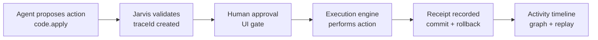
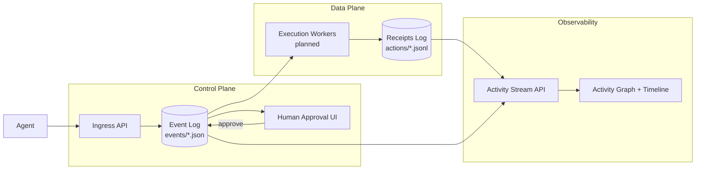

# Jarvis HUD


**Status:** v0.1 Control Plane Alpha

Event-sourced control plane for AI agent execution. AI proposes, humans authorize, every action produces receipts. Inspired by control-plane architectures used in Kubernetes and Temporal.

## TL;DR

Jarvis HUD is an event-sourced control plane for AI agent execution.

Agents propose actions → humans approve → workers execute → receipts are written.

Key properties:
- Human-gated execution
- Append-only event log
- Deterministic lifecycle replay
- Traceable receipts for every action

---

## What is Jarvis HUD?

Jarvis HUD is an **AI control plane**: a governance layer that sits between AI agents and real system actions.

Agents can propose actions, but execution only happens after validation, human approval, and receipt logging. Every step is traceable and replayable.

---

## The Control Plane Loop

Jarvis enforces a simple, auditable lifecycle:

1. **Agent proposes** an action (`code.apply`)
2. **Jarvis validates** and records a `traceId`
3. **Human approves** in the UI
4. **Execution occurs**
5. **Receipt is recorded** (commit hash, rollback, stats)
6. **Activity timeline reconstructs the trace**

### Control Plane Flow



→ [Architecture overview](docs/architecture/jarvis-control-plane.md)

---

## System Architecture

Jarvis sits between AI agents and system execution, enforcing validation, approval, and receipt logging while emitting an event stream for observability and replay. Jarvis separates the control plane (validation, approval, event emission) from the data plane (execution workers).



Execution is driven by consuming the event log, not by synchronous API handlers. The event log is append-only and keyed by `traceId`, allowing the entire execution lifecycle to be reconstructed deterministically. *Current v0.1: execute endpoint writes receipts synchronously; worker model is the architectural target.*

**Control plane vs data plane:**

- **Control plane** — validate, approve, emit events
- **Data plane** — workers execute, emit receipts

**Implementation references:**

| Component | Path |
|-----------|------|
| Ingress API | `src/app/api/ingress/` |
| Approval + Execution | `src/app/api/approvals/`, `src/app/api/execute/` |
| Receipts | `src/lib/action-log.ts` |
| Activity Stream | `src/app/api/activity/stream/` |
| Activity Graph | `src/components/ActivityGraph.tsx` |

---

## Event Model

Jarvis records execution lifecycle events in the append-only event log.

| Event | Meaning |
|-------|---------|
| `proposal_created` | Agent submitted a proposed action |
| `proposal_validated` | Ingress validation passed |
| `proposal_approved` | Human authorized execution |
| `execution_started` | Execution adapter began running |
| `execution_completed` | Adapter finished successfully |
| `receipt_created` | Action receipt written to `{JARVIS_ROOT}/actions/*.jsonl` |

Events are correlated using a shared `traceId`, allowing the complete lifecycle of an agent action to be reconstructed deterministically.

*`traceId` → links proposal, approval, execution, and receipt events*

---

## Run the Demo (60 seconds)

Start the deterministic demo environment:

```bash
pnpm demo:boot
```

Verify the system is ready:

```bash
pnpm demo:verify
```

Generate a proposal:

```bash
pnpm demo:smoke
```

Then open http://127.0.0.1:3001 and http://127.0.0.1:3001/activity. Approve the proposal → execute → replay the trace.

→ [Full runbook](DEMO.md)

### OpenClaw Integration

OpenClaw can propose actions to Jarvis via signed ingress (`POST /api/ingress/openclaw`). The flow is verified: OpenClaw smoke → pending proposal → human approve → execute → receipt. See [OpenClaw Integration Verification](docs/openclaw-integration-verification.md) for the full runbook.

### Demo Video

Episode 2 filmed. See [docs/video/](docs/video/) for the film checklist and artifacts.

---

## Key Components

| Component | Purpose |
|-----------|---------|
| Activity Stream | Normalized event feed for the control plane |
| Approval Layer | Human gate before execution |
| Execution Engine | Performs approved actions |
| Action Log | Writes receipts to `{JARVIS_ROOT}/actions/*.jsonl` |
| Activity Graph | Visual trace reconstruction with replay |

---

## Core Properties

Jarvis enforces several guarantees for AI-driven execution:

- **Human-in-the-loop** — execution requires explicit approval
- **Traceability** — every action is tied to a `traceId`
- **Receipts** — execution results are written to an immutable action log
- **Replayability** — traces can be reconstructed and replayed in the Activity Graph
- **Deterministic demo environment** — `demo:boot` / `demo:verify` / `demo:smoke`

---

## Design Principles

Jarvis HUD is designed around several architectural principles:

- **Separation of proposal and execution** — agents propose actions, but execution is gated
- **Event-first architecture** — all activity is emitted as events and can be reconstructed
- **Receipts over logs** — executions produce structured receipts rather than unstructured logs
- **Human authority boundary** — the control plane preserves a clear human-in-the-loop decision point

---

## Positioning

Jarvis HUD is a **Kubernetes-like control plane** for AI agent actions. Its current focus is controlled execution: validate, approve, execute, receipt.

Architecturally, Jarvis borrows ideas from both Kubernetes-style control planes and Temporal-style workflow history. The v0.1–v0.3 roadmap emphasizes policy, approval, receipts, and replay for one-shot actions. Workflow semantics (retries, multi-step chains, resumable state) may emerge in later versions where they earn their place.

**Decision rule for design choices:** If the core question is *"Should this action be allowed and executed?"* → lean Kubernetes. If it is *"How does this multi-step process progress over time?"* → lean Temporal. Right now Jarvis focuses on the first.

---

## Focus (v0.x Direction)

Jarvis HUD v0.x focuses on single-developer workflows on a single machine.

The goal is to provide a clear, safe execution boundary between AI agents and the developer's system, where proposed actions are visible, reviewable, and auditable before execution.

This approach emphasizes:
- Local-first execution
- Explicit human approval
- Traceable action lifecycles
- Deterministic replay through event logs

The architecture remains remote-capable: workers are designed as consumers of the event log and can run locally or remotely. However, distributed execution, multi-tenancy, and orchestration concerns are intentionally deferred until later versions.

In short:

*v0.x optimizes for depth of single-developer UX, not breadth of distributed infrastructure.*

**Design rule for v0.x:** Does this change make Jarvis safer, clearer, or faster for one developer using agents locally?

---

## Why This Exists

Most AI agents today can directly execute actions. Jarvis introduces governance, traceability, and receipts so that AI actions are auditable, reversible, human-controlled, and observable. This turns agent execution into a controlled system operation, not a black box.

---

## Overview

Jarvis HUD is a local-first control plane for AI-driven workflows.

Modern AI agents can write files, modify code, run tools, and call APIs.  
The capability gap is not intelligence — it is control.

Jarvis HUD introduces a strict execution boundary:

- Agents may **propose**
- Humans must **authorize**
- Execution produces **deterministic artifacts**
- Every executed action produces a **receipt**
- Approval is never execution
- The model is never a trusted principal

Jarvis HUD is agent-agnostic.  
It does not replace agents.  
It governs what they are allowed to execute.

---

## Core Principle

**Autonomy in thinking. Authority in action.**

AI systems may generate plans, diffs, content, and tool requests.

They cannot execute them without explicit human authorization.

This preserves:

- Human verification
- Clear accountability
- Replayable trace history
- Policy enforcement
- Safe delegation

---

## Execution Model

```
Agent → Proposal → Approval Queue → Execute → Receipt (Artifact + Log)
```

### Key Guarantees

- Approval ≠ execution
- No silent execution
- Receipts required for every executed action
- Model output is not authority
- External APIs remain disabled unless explicitly policy-gated
- Optional authentication + step-up for high-risk execution

---

## Current Execution Adapters

Jarvis HUD uses deterministic, local-first execution adapters.

Implemented:

- `code.diff` — Dry-run diff packaging (no code applied)
- `code.apply` — Local git commit only; no pushing (requires `JARVIS_REPO_ROOT`)
- `content.publish` — Local artifact creation
- `youtube.package` — Structured YouTube bundle output
- `system.note`
- `reflection.note`

Planned:

- Replay mode for full trace playback
- Policy v1 (risk tiers + allowlists)

All adapters must:

- Require approval before execution
- Produce artifacts
- Produce action log receipts
- Respect Thesis Lock constraints

---

## Storage Model

Default root: `${JARVIS_ROOT}` (local filesystem)

Example structure:

```
events/{date}.json
actions/{date}.jsonl
code-diffs/{date}/{approvalId}/
code-applies/{date}/{approvalId}/
publish-queue/{date}/
youtube-packages/{date}/{approvalId}/
```

Execution produces:

- Artifact bundle
- Structured log entry
- Deterministic output directory

No external network calls occur unless explicitly enabled.

---

## Security Model

Jarvis HUD follows a Zero Trust approach:

- Never trust model output
- Always require human authorization
- Log all executed actions
- Separate proposal from execution
- Gate high-risk actions behind authentication and step-up

See:

- `docs/security/agent-execution-model.md`
- `docs/decisions/0001-thesis-lock.md`

---

## Non-Goals

Jarvis HUD is not:

- An LLM wrapper
- An autonomous execution engine
- A prompt optimization tool
- A replacement for agent frameworks
- A general AI orchestration system

It is a control plane.

---

## Development

Stack:

- TypeScript
- Next.js (control plane + API)
- React (approval UI)
- Tailwind
- pnpm

Run locally:

```bash
pnpm install
pnpm dev
```

Default port 3000: `http://127.0.0.1:3000`. The demo flow (`pnpm demo:boot`) uses port 3001.

Auth can be enabled via environment variables.

For `code.apply`: set `JARVIS_REPO_ROOT` to the git repo path. Working tree must be clean before executing.

---

## Documentation

- [Architecture](docs/architecture/jarvis-control-plane.md) — Control plane lifecycle, trace model, event types
- [Demo Runbook](DEMO.md) — Deterministic demo, verify, smoke, failure actions
- [OpenClaw Integration Verification](docs/openclaw-integration-verification.md) — Ingress, env, approval, execution, receipt runbook
- `docs/roadmap/0000-master-plan.md`
- `docs/strategy/positioning-secure-ai-code-execution.md`
- `docs/decisions/0001-thesis-lock.md`
- `docs/decisions/0002-money-arc-and-icp.md`

---

## License

Apache License 2.0.
