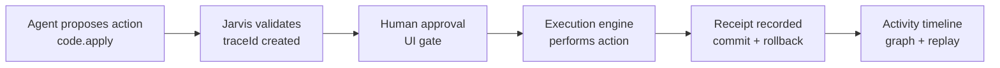

# Jarvis HUD

**Status:** v0.1 Control Plane Alpha

Secure AI code execution control plane. AI proposes. Humans authorize. Every action produces receipts.

---

## What is Jarvis HUD?

Jarvis HUD is an **AI control plane**: a governance layer that sits between AI agents and real system actions.

Agents can propose actions, but execution only happens after validation, human approval, and receipt logging. Every step is traceable and replayable.

---

## The Control Plane Loop

Jarvis enforces a simple, auditable lifecycle:

1. **Agent proposes** an action (`code.apply`)
2. **Jarvis validates** and records a `traceId`
3. **Human approves** in the UI
4. **Execution occurs**
5. **Receipt is recorded** (commit hash, rollback, stats)
6. **Activity timeline reconstructs the trace**

### Control Plane Flow



→ [Architecture overview](docs/architecture/jarvis-control-plane.md)

---

## Run the Demo (60 seconds)

Start the deterministic demo environment:

```bash
pnpm demo:boot
```

Verify the system is ready:

```bash
pnpm demo:verify
```

Generate a proposal:

```bash
pnpm demo:smoke
```

Then open http://127.0.0.1:3001 and http://127.0.0.1:3001/activity. Approve the proposal → execute → replay the trace.

→ [Full runbook](DEMO.md)

### Demo Video (2 minutes)

Coming soon.

---

## Key Components

| Component | Purpose |
|-----------|---------|
| Activity Stream | Normalized event feed for the control plane |
| Approval Layer | Human gate before execution |
| Execution Engine | Performs approved actions |
| Action Log | Writes receipts to `{JARVIS_ROOT}/actions/*.jsonl` |
| Activity Graph | Visual trace reconstruction with replay |

---

## Why This Exists

Most AI agents today can directly execute actions. Jarvis introduces governance, traceability, and receipts so that AI actions are auditable, reversible, human-controlled, and observable. This turns agent execution into a controlled system operation, not a black box.

---

## Overview

Jarvis HUD is a local-first control plane for AI-driven workflows.

Modern AI agents can write files, modify code, run tools, and call APIs.  
The capability gap is not intelligence — it is control.

Jarvis HUD introduces a strict execution boundary:

- Agents may **propose**
- Humans must **authorize**
- Execution produces **deterministic artifacts**
- Every executed action produces a **receipt**
- Approval is never execution
- The model is never a trusted principal

Jarvis HUD is agent-agnostic.  
It does not replace agents.  
It governs what they are allowed to execute.

---

## Core Principle

**Autonomy in thinking. Authority in action.**

AI systems may generate plans, diffs, content, and tool requests.

They cannot execute them without explicit human authorization.

This preserves:

- Human verification
- Clear accountability
- Replayable trace history
- Policy enforcement
- Safe delegation

---

## Execution Model

```
Agent → Proposal → Approval Queue → Execute → Receipt (Artifact + Log)
```

### Key Guarantees

- Approval ≠ execution
- No silent execution
- Receipts required for every executed action
- Model output is not authority
- External APIs remain disabled unless explicitly policy-gated
- Optional authentication + step-up for high-risk execution

---

## Current Execution Adapters

Jarvis HUD uses deterministic, local-first execution adapters.

Implemented:

- `code.diff` — Dry-run diff packaging (no code applied)
- `code.apply` — Local git commit only; no pushing (requires `JARVIS_REPO_ROOT`)
- `content.publish` — Local artifact creation
- `youtube.package` — Structured YouTube bundle output
- `system.note`
- `reflection.note`

Planned:

- Replay mode for full trace playback
- Policy v1 (risk tiers + allowlists)

All adapters must:

- Require approval before execution
- Produce artifacts
- Produce action log receipts
- Respect Thesis Lock constraints

---

## Storage Model

Default root: `${JARVIS_ROOT}` (local filesystem)

Example structure:

```
events/{date}.json
actions/{date}.jsonl
code-diffs/{date}/{approvalId}/
code-applies/{date}/{approvalId}/
publish-queue/{date}/
youtube-packages/{date}/{approvalId}/
```

Execution produces:

- Artifact bundle
- Structured log entry
- Deterministic output directory

No external network calls occur unless explicitly enabled.

---

## Security Model

Jarvis HUD follows a Zero Trust approach:

- Never trust model output
- Always require human authorization
- Log all executed actions
- Separate proposal from execution
- Gate high-risk actions behind authentication and step-up

See:

- `docs/security/agent-execution-model.md`
- `docs/decisions/0001-thesis-lock.md`

---

## Non-Goals

Jarvis HUD is not:

- An LLM wrapper
- An autonomous execution engine
- A prompt optimization tool
- A replacement for agent frameworks
- A general AI orchestration system

It is a control plane.

---

## Development

Stack:

- Next.js 16 (App Router)
- React 19
- TypeScript
- Tailwind v4
- pnpm

Run locally:

```bash
pnpm install
pnpm dev
```

Default:

```
http://127.0.0.1:3000
```

Auth can be enabled via environment variables.

For `code.apply`: set `JARVIS_REPO_ROOT` to the git repo path. Working tree must be clean before executing.

---

## Documentation

- [Architecture](docs/architecture/jarvis-control-plane.md) — Control plane lifecycle, trace model, event types
- [Demo Runbook](DEMO.md) — Deterministic demo, verify, smoke, failure actions
- `docs/roadmap/0000-master-plan.md`
- `docs/strategy/positioning-secure-ai-code-execution.md`
- `docs/decisions/0001-thesis-lock.md`
- `docs/decisions/0002-money-arc-and-icp.md`

---

## License

Apache License 2.0.
