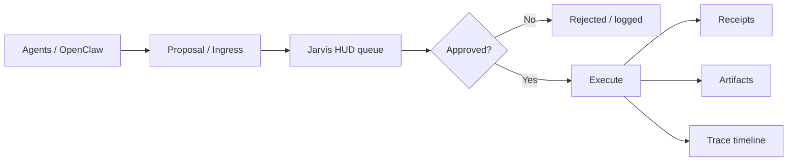
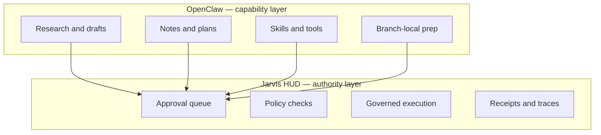
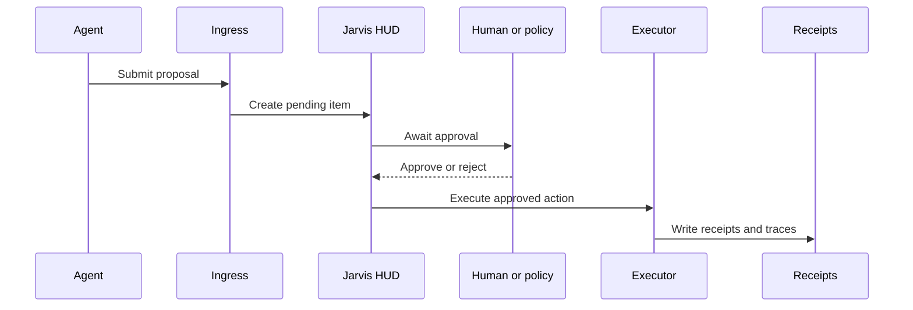
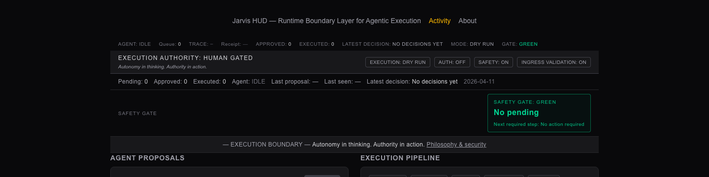
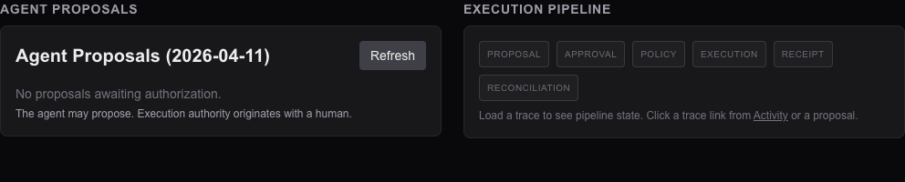
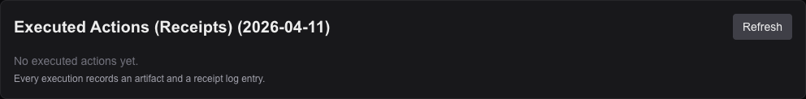
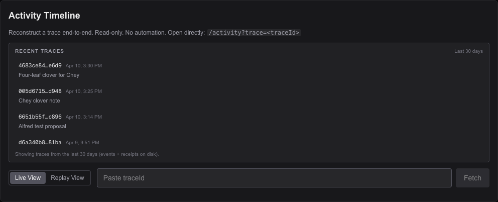

# Jarvis HUD

**Control plane for governed AI execution.**

Jarvis HUD sits between **AI agents** (e.g. [OpenClaw](https://github.com/openclaw/openclaw)) and **real-world actions**. Agents **propose**. Humans (or explicit policy) **approve**. The system **executes** only after that gate. **Every step leaves receipts and traces.**

> **Status:** Active development — **demo-ready** locally with **OpenClaw-signed ingress** ([Investor / demo path](#investor--demo-path)).


## Why this exists

Modern agents are powerful, but **power without authority boundaries is reckless**. Jarvis HUD makes the lifecycle explicit: **propose → approve → execute → receipt → trace**, so automation stays **observable** and accountable.

Pair a **capability layer** (OpenClaw: research, drafts, skills, tools) with an **authority layer** (Jarvis: queue, policy, execution, audit).

## Core thesis

- **Approval is not execution** — two different steps.
- **Agents propose; they do not commit** high-stakes effects on their own.
- **The model is not a trusted principal** — humans and policy remain in charge.
- **Every action produces proof** — receipts, artifacts, and replayable **traces**.
- **Autonomy in thinking. Authority in action.**

Full narrative: [docs/strategy/jarvis-hud-video-thesis.md](docs/strategy/jarvis-hud-video-thesis.md) · [ADR: Thesis Lock](docs/decisions/0001-thesis-lock.md).

## Architecture



### OpenClaw vs Jarvis HUD



### Proposal lifecycle



### What crosses the boundary

| Typically **gated in Jarvis** (examples) | Typically **local to OpenClaw** (examples) |
|------------------------------------------|--------------------------------------------|
| Outbound sends, posting, publishing | Drafts and ideation |
| Payments and purchases | Research and summaries |
| Deploys and risky infra changes | Internal notes |
| Irreversible commitments | Tool prep on a branch |

Exact **kinds** and **policy** depend on your configuration — see [execution scope](docs/execution-scope.md) and [decisions](docs/decisions/).

## Who it’s for

**Who:** Developers and operators who run **local agents with real permissions** (files, tools, execution) and need a **human gate** before real-world effects.

**What:** A **Next.js** control plane with HMAC-signed **OpenClaw** ingress, policy-gated execution, and durable receipts under **`JARVIS_ROOT`** (default `~/jarvis`).

---

## Visual

Control plane at a glance (click through for architecture detail):

[](docs/architecture/control-plane.md)

*Optional:* Record a short loop (proposal → approve → receipt) for the README — see [docs/video/jarvis-demo-recording.md](docs/video/jarvis-demo-recording.md).

---

## Ports: normal dev vs demo boot

| Mode | Command | Default URL | Notes |
|------|---------|-------------|--------|
| **Normal development** | `pnpm dev` | **http://localhost:3000** | Override with `PORT=3001 pnpm dev`, etc. |
| **Demo / ingress rehearsal** | `pnpm demo:boot` | **http://localhost:3001** | Loads `scripts/demo-env.sh`: OpenClaw ingress **on**, shared **secret**, `PORT=3001`. |

Use the **same** base URL and secret on the **OpenClaw** side as on Jarvis, or signed ingress will fail (usually **401**). Details: [docs/openclaw-integration-verification.md](docs/openclaw-integration-verification.md).

---

## Investor / demo path

**Goal:** The story is obvious on the first screen here; **proof** is a **repeatable** OpenClaw → Jarvis **proposal** → human **approve** → explicit **execute** → **receipt** path — not “it worked once.”

1. **Boot Jarvis for demo:** `pnpm demo:boot` (wait for Ready / Local URL).
2. **Preflight:** `pnpm demo:verify` → expect `OK: config + stream reachable`.
3. **Create proposals from this repo:** `pnpm demo:smoke` (ingress + apply smoke; note **`traceId`** in output).
4. **OpenClaw (separate checkout):** same **`JARVIS_INGRESS_OPENCLAW_SECRET`** and **`JARVIS_BASE_URL`** as Jarvis → run **`pnpm jarvis:smoke`** (or your packaged smoke) **twice in a row** until it’s boring.
5. **In the UI:** Approvals → approve → execute (per action type) → show **receipt** and **Activity / trace** for that **`traceId`**.

Full script, receipt shapes, and failure table: **[DEMO.md](DEMO.md)** · OpenClaw handoff: **[docs/openclaw-integration-verification.md](docs/openclaw-integration-verification.md)**.

---

## Quick Start (developers)

```bash
pnpm install
cp env.example .env.local   # optional; see docs/setup/env.md
pnpm dev
```

Open **http://localhost:3000**. For a **production-style** build: `pnpm build && pnpm start`. For a **guided demo** with ingress env pre-wired, use **`pnpm demo:boot`** and the [Investor / demo path](#investor--demo-path) above.

---

## Core lifecycle

```
Agent → Proposal → Approval → Execution → Receipt → Trace
```

- **Agents propose** (UI, API, or signed **OpenClaw** ingress).
- **Humans approve** (or reject) in the HUD.
- **Execution** runs only after approval — **separate** from the approval click.
- **Proof:** receipt log + artifacts + trace reconstruction.

---

## HTTP surface

Jarvis sits between AI agents and system execution:

- **Agent layer** — systems **propose** actions (e.g. OpenClaw via HMAC-signed `POST /api/ingress/openclaw`).
- **Control plane** — verification, **human** approval, policy, **orchestrated execution**.
- **Audit layer** — receipts under `JARVIS_ROOT` (default `~/jarvis`), policy logs, activity timeline.

**Key routes:**

| Stage     | Route                            | Purpose                  |
|-----------|----------------------------------|--------------------------|
| Ingress   | `POST /api/ingress/openclaw`     | Signed proposals         |
| Approval  | `GET/POST /api/approvals`        | List / approve / deny    |
| Execution | `POST /api/execute/[approvalId]` | Policy gate → adapters |
| Trace     | `GET /api/traces/[traceId]`      | Reconstruct session      |
| Trace     | `GET /api/traces/recent`        | Recent trace ids (disk)  |
| Connectors | `GET /api/connectors/openclaw/health` | OpenClaw trust signal (disk + env) |

→ [Control plane architecture](docs/architecture/control-plane.md)

---

## Features

- **Human-in-the-loop** — Operators **approve** or deny before execution proceeds.
- **Execution separated from approval** — Approve does not run adapters by itself; execute is explicit.
- **Policy-gated execution** — Allow/deny before adapters run.
- **Receipts and proof** — Action log + artifacts per execution; traceable **`traceId`**.
- **OpenClaw ingress** — HMAC-signed proposals when enabled (`docs/setup/env.md`).
- **Bounded adapters** — e.g. `system.note`, `code.diff`, `code.apply`, `youtube.package`, recovery classes.
- **Trace timeline** — Reconstruct proposal → outcome for audit and demo.

---

## Development / demo commands

| Command              | Purpose                              |
|----------------------|--------------------------------------|
| `pnpm dev`           | Dev server (**port 3000** by default) |
| `pnpm dev:port`      | Uses `PORT` from environment         |
| `pnpm demo:boot`     | Clean boot + **demo env** (ingress, **3001**) |
| `pnpm demo:verify`   | Pre-demo: config + activity stream   |
| `pnpm demo:smoke`    | Ingress + apply smoke tests          |
| `pnpm ingress:smoke` | `system.note` ingress smoke          |
| `pnpm jarvis:doctor` | Preflight (ingress, secret, allowlist) |
| `pnpm test:unit`     | Unit tests                           |

**Environment:** `env.example` → `.env.local`. OpenClaw: `JARVIS_INGRESS_OPENCLAW_ENABLED=true`, `JARVIS_INGRESS_OPENCLAW_SECRET` (≥32 chars), `JARVIS_INGRESS_ALLOWLIST_CONNECTORS=openclaw`. See [docs/setup/env.md](docs/setup/env.md).

---

## Screenshots

Captured from the **local dev UI** in **dark mode** (empty queue, **dry run** — illustrative only). The first image is a **top crop** of the HUD; the others are **panel crops** so each section reads clearly on GitHub (regenerate with `pnpm screenshots:readme` while `pnpm dev` is on port **3000**).

### Mission, authority, and safety gate



### Agent proposals and execution pipeline



### Executed actions (receipts)



### Activity timeline and trace



---

## Status

**Current focus:** OpenClaw **signed ingress** → Jarvis HUD **pending approval** → **governed execution** with receipts and traces. See [DEMO.md](DEMO.md) and [OpenClaw integration verification](docs/openclaw-integration-verification.md).

---

## Roadmap

- Richer approval policies and execution scopes by action kind
- Receipt and trace UX (viewer, exports)
- Audit export and multi-agent orchestration patterns
- Connector and health surfaces for integrated agents

---

## Contributing

Contributions are welcome. Please preserve the thesis: **agents propose**, **humans approve**, **execution is separate**, **every action leaves proof**.

1. Open an issue for substantial changes  
2. Fork, branch, PR with a clear description  
3. Ensure **`pnpm test:unit`** passes  

See [CONTRIBUTING.md](CONTRIBUTING.md).

---

## Documentation

- [Architecture](docs/architecture/control-plane.md)
- [Security model](docs/architecture/security-model.md)
- [Policy decision logs](docs/architecture/policy-decision-logs.md)
- [OpenClaw integration](docs/openclaw-integration-verification.md)
- [OpenClaw coordinator / builder metadata](docs/openclaw-agent-identity.md)
- [Local verification: OpenClaw + Jarvis (command checklist)](docs/local-verification-openclaw-jarvis.md)
- [Submit proposal JSON (`pnpm jarvis:submit`)](docs/jarvis-proposal-submit.md)
- [Demo runbook](DEMO.md)
- [Environment variables](docs/setup/env.md)
- [Audit export (Phase 3)](docs/audit-export.md)
- [Execution scope / blast radius (Phase 4)](docs/execution-scope.md)
- [Traces & deep links (Phase 5)](docs/traces.md)
- [OpenClaw connector health](docs/connectors.md)
- [Live demo reliability checklist](docs/live-demo-reliability-checklist.md)
- [GitHub About / social copy](docs/marketing/social-copy.md)
- [Security reporting](SECURITY.md)

---

## Author

**Ben Tankersley**  
Building systems at the intersection of AI, music, and infrastructure  
https://ctrlstrum.com

---

## License

Apache License 2.0.
