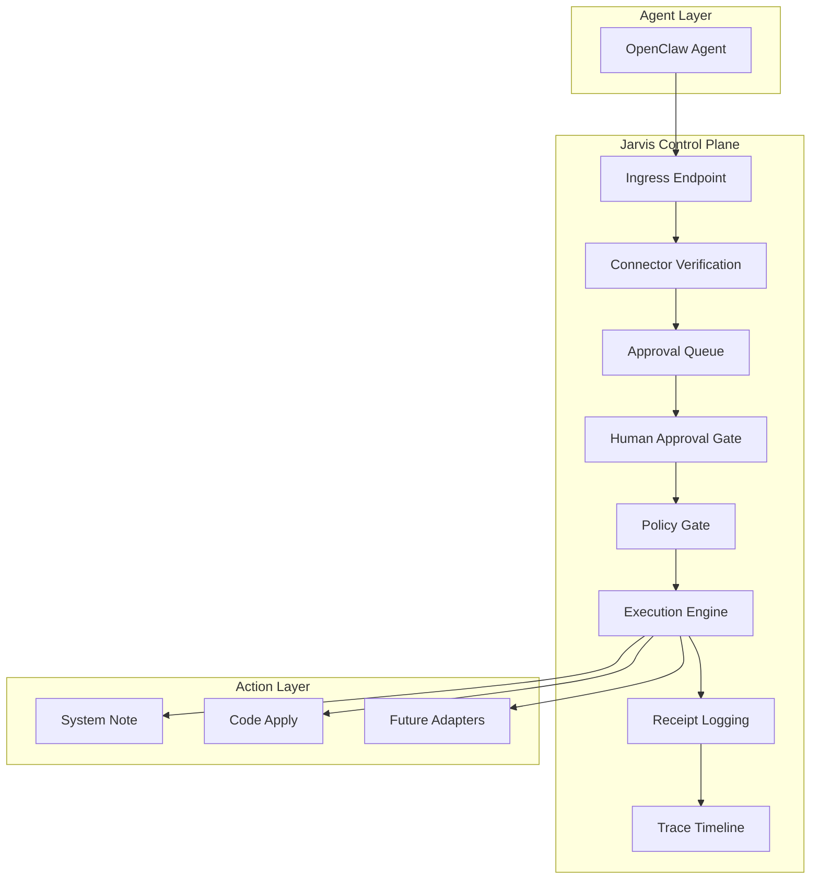
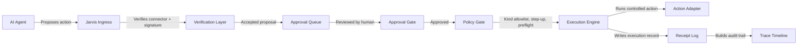

# Jarvis Control Plane Architecture

Jarvis HUD is an **AI execution control plane**. It sits between agents (e.g. OpenClaw) and real-world actions, enforcing human authority over execution.

**Core thesis:** Agents propose → Humans approve → System executes → Receipts recorded.

---

## Architecture Diagram

---

## Flow: Agent → Proposal → Approval → Policy Gate → Execution → Receipt → Trace

---

## Lifecycle Stages

| Stage | Description |
|-------|--------------|
| **Proposal** | Agent submits action via ingress connector (e.g. OpenClaw) |
| **Verification** | Jarvis verifies connector identity, shared secret, proposal structure |
| **Approval** | Human operator reviews in Jarvis HUD UI; actions cannot execute without approval |
| **Policy Gate** | Built-in checks (kind allowlist, auth step-up, preflight) run before any adapter; blocks execution if policy fails |
| **Execution** | Approved actions run through controlled adapters (system.note, code.apply, etc.) |
| **Receipt** | Every execution produces a receipt at `~/jarvis/actions/YYYY-MM-DD.jsonl` |
| **Trace** | Timeline of proposal received → approval → execution → receipt for audit |

---

## Policy Gate

Jarvis enforces a **policy gate** at execute-time — before any adapter runs. If policy blocks, no adapter code runs. Implemented in `evaluateExecutePolicy()`.

**Today (built-in, in code):**

- **Kind allowlist** — Only allowed action kinds (e.g. `system.note`, `code.apply`, `code.diff`) can execute.
- **Auth step-up** — When auth is enabled, high-risk execution may require step-up authentication.
- **code.apply preflight** — Requires `JARVIS_REPO_ROOT`, clean worktree, and other preflight checks.

**Planned later:** Config-driven policy rules, per-kind approval requirements, file-based policy definitions.

See [ADR-0003: Execution Policy v1](../decisions/0003-execution-policy-v1.md).

---

## Routes

| Stage | Route | Purpose |
|-------|-------|---------|
| Ingress | `POST /api/ingress/openclaw` | Receive signed proposals from connectors |
| Approval | `GET /api/approvals`, `POST /api/approvals/[id]` | List and approve/deny proposals |
| Execution | `POST /api/execute/[approvalId]` | Execute approved proposals |
| Trace | `GET /api/traces/[traceId]` | Reconstruct session from trace ID |

---

## Authority Boundary

The control plane enforces:

- The model may generate proposals.
- The model may not execute actions.
- Execution authority originates only from a human.
- Policy scopes must be human-defined.
- Automation may reduce friction, but must not transfer authority.

---

## See Also

- [Agent Execution Model](../security/agent-execution-model.md) — security constraints
- [ADR-0001: Thesis Lock](../decisions/0001-thesis-lock.md) — rationale for authority boundary
- [ADR-0003: Execution Policy v1](../decisions/0003-execution-policy-v1.md) — policy gate, kind allowlist, step-up
- [OpenClaw Integration Verification](../openclaw-integration-verification.md) — ingress, env, troubleshooting
