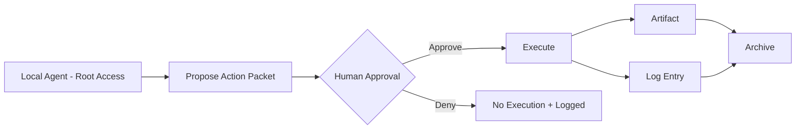

> **Canonical Narrative Spec**
>
> This document defines the non-negotiable product thesis for Jarvis HUD.
> All architectural decisions, feature expansions, and integrations must be
> consistent with the Thesis Lock section at the bottom of this document.
>
> If a proposed feature violates Thesis Lock, the feature is incorrect — not the thesis.

# Jarvis HUD – Video Thesis

---

## Executive Summary

Agentic AI is shifting from output assistants to action-taking systems.
When agents gain access to tools, credentials, and production environments, the dominant risk is no longer incorrect output — it is uncontrolled execution.

Jarvis HUD is an approval and control center for local agents with root access.

Agents can propose anything.
Execution requires explicit human approval.
Every action produces receipts (artifact + log).

Autonomy in thinking.
Authority in action.

---

## Market Narrative

Agent frameworks and emerging standards are accelerating tool connectivity.
As agents move from experimentation into production, governance and control lag behind capability.

The modern risk model includes:

- Excessive agency (unchecked autonomy)
- Confused-deputy patterns
- Tool injection
- Credential concentration
- Silent execution without audit trail

The gap is not intelligence.
The gap is runtime control.

Jarvis HUD addresses the action layer.

---

## Messaging Pillars

### 1. Root Access Without Unchecked Authority
High privilege is acceptable.
Unbounded execution is not.

### 2. Propose → Approve → Execute Separation
Approval does not equal execution.
Execution is an explicit step.

### 3. Receipts
Every action produces:

- Artifact
- Log entry
- Traceable provenance

If it is not logged and reproducible, it did not happen.

### 4. Least Privilege (Forward Path)
Execution scopes will narrow over time.
Blast radius should shrink as capability expands.

### 5. Standards Are the Wedge
As tool access becomes standardized, control planes become mandatory.

---

## Positioning

Jarvis HUD begins as a Personal OS for developers running local agents with real permissions.

It evolves into a governance pattern for:

- Security teams
- Technical founders
- Agentic workflow builders
- GRC stakeholders

Personal control now.
Production governance later.

---

## Script Variants

### 15-Second Hook

"Yeah… my agent has root access."
"No — he can't use it without asking permission."
"Jarvis HUD is the approval and control center."
"Agents propose. I approve. Then I execute."
"And every action leaves receipts."

---

### 1-Minute Short

Agentic AI isn't a demo anymore.
When agents call tools, prompt injection becomes action risk.

So I built Jarvis HUD:
An approval and control center for local agents with root access.

Agent proposes.
Human approves.
Execution is separate.
And every action leaves receipts.

Root access with adult supervision.

---

### 3–4 Minute Thesis

If your agent has root access and no approval layer,
you don't have agentic AI —
you have a denial-of-service attack on your own life.

The industry is standardizing tool access.
Capability is accelerating.
Control is not.

Jarvis HUD inserts the missing layer:

Propose.
Approve.
Execute.
Log.
Archive.

Agents get autonomy in thinking.
Humans keep authority in action.

---

## Storyboard

| Phase | Focus | Mechanism |
|-------|-------|-----------|
| Hook | Stakes | Root access + permission reversal |
| Context | Market shift | Tool connectivity → action risk |
| Demo | Boundary | Propose → Approve → Execute |
| Proof | Receipts | Artifact + log |
| Close | Thesis | Authority in action |

---

## Control Plane Diagram

---

## Rollout Plan

*To be refined as distribution channels and launch sequence are finalized.*

- [x] Demo-ready HUD (local, dry-run only) — README investor/demo path, `DEMO.md`, OpenClaw verification doc
- [ ] Video thesis publication
- [ ] Developer-focused landing
- [ ] Production governance roadmap

---

## Distribution Assets

| Asset | Purpose |
|-------|---------|
| 15-second hook | Social / intro |
| 1-minute short | Context + demo |
| 3–4 minute thesis | Deep narrative |
| Whitepaper | Investor / GRC |
| Landing page | Conversion |

---

## Strategic Connections

Where this document connects:

- **Approval Engine** — Propose → Approve → Execute boundary
- **Policy Threshold System** — Future escalation and scope limits
- **Artifact Logging System** — Receipts and provenance
- **Execution Layer** — Explicit, logged, auditable
- **Future MCP Integration** — Standardized tool access, mandatory control

See also:

- [Control Plane Architecture](../architecture/control-plane.md)
- [Agent Execution Model](../security/agent-execution-model.md)
- [ADR-0001: Thesis Lock](../decisions/0001-thesis-lock.md)
- [Agent team v1](./agent-team-v1.md)

---

## Thesis Lock (Do Not Drift)

Jarvis HUD is an approval and control center for local agents with root access.

Non-negotiable principles:

1. Agents can propose anything.
2. Execution requires explicit human approval.
3. Approval does not equal execution.
4. Every action produces receipts (artifact + log).
5. The model is not a trusted principal.
6. Autonomy in thinking. Authority in action.
