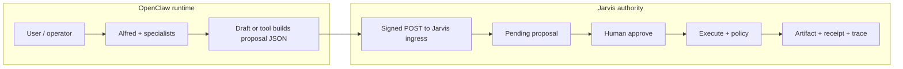

# Runtime (OpenClaw) + team + Jarvis — one narrative loop v1

**Purpose:** A **single readable story** for how the **agent runtime** (OpenClaw), **team roles** (Alfred + specialists), and **Jarvis** fit together—how work **loops** across conversation and governed execution. This complements the wire-level map in [Jarvis ↔ OpenClaw system overview](../architecture/jarvis-openclaw-system-overview.md) and the normative rules in [Agent team contract v1](./agent-team-contract-v1.md). It does **not** replace setup runbooks or integration verification.

**Normative boundary:** [Thesis Lock](../decisions/0001-thesis-lock.md) — agents may propose; execution requires explicit human approval; approval ≠ execution; every real effect produces receipts; the model is not a trusted principal.

---

## 1. Two layers (remember this first)

| Layer | Where it lives | What it does |
|--------|----------------|--------------|
| **Capability / runtime** | **OpenClaw** (gateway, workspace, models, tools, Control UI) | **Thinking**, drafting, routing, tool calls, building **proposal JSON**. Chat and agent personas live **here**. |
| **Authority / proof** | **Jarvis HUD** | **Ingress**, **approval queue**, **policy**, **execute**, **artifacts**, **receipts**, **traces**. Human decisions and audit spine live **here**. |

Jarvis is **not** the chat runtime. OpenClaw is **not** the system of record for **approved execution**. The loop **connects** them at a single seam: **`POST /api/ingress/openclaw`**.

---

## 2. What “runtime” means here

**OpenClaw** runs the **work session**: the operator or user talks to **Alfred** (or another entry), models run, tools run (read files, call governed “propose to Jarvis” helpers, etc.). Multiple turns, handoffs, and specialist drafts are all **runtime behavior**.

**Jarvis** sees only **discrete proposals**: signed, validated payloads with a **`kind`**, **title**, **summary**, **payload**, and **source** metadata. Whether the proposal came from Alfred alone, Research after a handoff, or a CLI script does not change the **authority** path.

---

## 3. The team inside the runtime

Day-to-day **law** for routing and handoffs is in [Agent team contract v1](./agent-team-contract-v1.md). In one paragraph:

- **Alfred** is the default **intake**: triage, consent framing, **routing** to specialists when the task is not his to own.
- **Research** owns **evidence** and research-shaped proposals (e.g. `system.note` digests).
- **Creative** owns **variants** and creative-shaped proposals (e.g. drafts toward `content.publish`).
- **Operator** (optional, spec deferred) would own queue shaping and packaging **when pain proves it**—not a license to bypass Jarvis.

**Handoffs** (Alfred-only, recommend handoff, embedded specialist output) are **runtime patterns**. They must still land **legible proposals** at the ingress boundary—clear **agent / coordinator** metadata and **one consent per execution** where effects differ ([ADR-0005](../decisions/0005-agent-team-batch-v0-per-item-execute.md) for batches).

---

## 4. End-to-end loop (conversation → proof)

**Narrative steps:**

1. **In OpenClaw:** work proceeds—questions, diagnosis, specialist output, packaging.
2. **When an effect is execution-shaped** (note write, email, publish, code apply, …): the runtime builds a **proposal** and **submits** it to Jarvis (not “the model executed it”).
3. **In Jarvis:** the proposal is **reviewed**; **approve** records intent; **execute** runs adapters under policy; **receipts** and **trace id** close the accountability loop.
4. **After execute:** the runtime may continue—follow-on proposals, reflections, or the next item in a **batch**—each effect still its own approval/execute where required.

**Idle OpenClaw** with **no recent ingress** does not mean Jarvis is wrong: it often means **no new proposals** were submitted; **truth** remains **events + receipts on disk** (see HUD copy on ingress recency).

---

## 5. Concrete pattern: flagship Flow 1 (two roles, one rail)

[Flagship team bundle v1](./flagship-team-bundle-v1.md) encodes **Alfred intake** then **Research digest** as **two** `system.note` proposals, same **`correlationId`**, **two traces**, **two receipts**. That is the cleanest **team** proof without merging authority into one blob: intake **≠** evidence; both still use **one** governed rail.

---

## 6. Reference: governed tools → ingress (this repo)

The **strict-governed** slice in `jarvis-hud` (`src/openclaw-strict-governed/`) shows tools that **only** build ingress bodies and call the Jarvis client—**no** silent local execution for governed effects. Product runtimes (OpenClaw in your stack) should follow the same **idea**: capability proposes, Jarvis executes.

---

## 7. What this document is not

- **Not** a substitute for [Local verification](../local-verification-openclaw-jarvis.md), [Operator checklist](../setup/openclaw-jarvis-operator-checklist.md), or [OpenClaw integration verification](../openclaw-integration-verification.md).
- **Not** the competitive story — see [Competitive landscape 2026](./competitive-landscape-2026.md).
- **Not** permission to skip ingress or merge unrelated effects into one approval.

---

## Related

- [Jarvis ↔ OpenClaw system overview](../architecture/jarvis-openclaw-system-overview.md)
- [Agent team contract v1](./agent-team-contract-v1.md)
- [Flagship team bundle v1](./flagship-team-bundle-v1.md)
- [OpenClaw V1 — Jarvis integration contract](../architecture/openclaw-v1-contract.md)
- [Platform roadmap — Phase 5](../roadmap/0004-phased-platform-plan.md) (operating model maturity)
